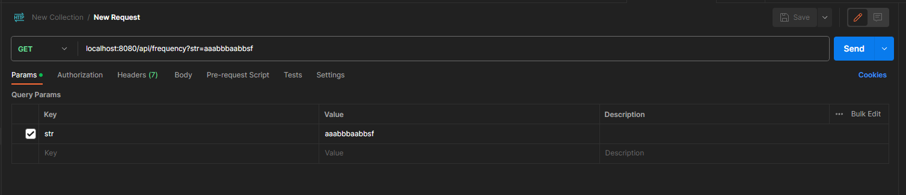
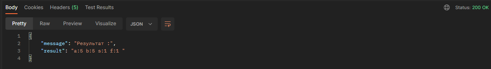

# ___Frequency___
___
Тестовое задание для компании **___+|Консалтинг___**

## Архитектура
Сервис представляет из себя простое  REST API вычисляющее частоту встречи символов по заданной строке.
Сервис основан на Spring Boot 3.1.3 .
Использовалась Java 17
_____
## Сборка проекта
```
mvn clean install
```

_____
## Функционал
```
 GET - вычисляющее частоту встречи символов по заданной строке
```
___
## Инструкция по применению
**Подключение к сервису по localhost:8080**

Входные параметры принимаются в обычном вормате String.

Формат вывода JSON.

Пример ввода:


Пример вывода:

___

     

Produced by Joker AXAXAXXAXXAXAXAXAX